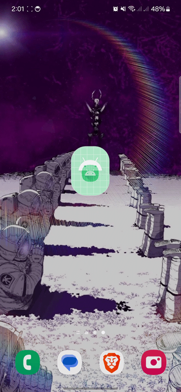

   [](https://jitpack.io/#darkryh/Cloudflare-Bypass)

# Cloudflare-Bypass

> **Note:** For devices running Android API level 30 or lower, it is recommended to specify a custom `userAgent` in the `WebView` settings to prevent being blocked by outdated browser warnings.

Cloudflare-Bypass is an Android library designed to seamlessly bypass Cloudflare's anti-bot protection using a custom `WebViewClient`. This library allows developers to load websites protected by Cloudflare's challenge without needing manual user intervention.

## Show-Case


## Features

- Custom `WebViewClient` for Cloudflare bypass
- Automatic handling of Cloudflare's anti-bot checks
- Easy integration into any Android project with minimal setup
- Supports bypass for sites using Cloudflare protection
- **NEW:** Configurable timeout and polling intervals for performance tuning
- **NEW:** Enhanced Cloudflare detection with multiple title patterns
- **NEW:** Memory leak prevention with automatic cleanup
- **NEW:** Comprehensive test suite with 90+ tests
- **NEW:** Performance monitoring and timeout callbacks

## Documentation

- **[Performance Guide](PERFORMANCE.md)** - Optimize bypass performance for your use case
- **[Troubleshooting Guide](TROUBLESHOOTING.md)** - Solutions to common issues
- **[Example App](app/)** - Sample implementation

## Requirements

- **Minimum SDK:** 21 (Android 5.0 Lollipop)
- **Compile SDK:** 34
- **Target SDK:** 34
- **Language:** Kotlin

## Getting Started

#### Add the JitPack repository to your root `build.gradle` at the end of the repositories section:

```gradle
allprojects {
    repositories {
        ...
        maven { url 'https://jitpack.io' }
    }
}
```

## Installation - Gradle
```gradle
dependencies {  
    implementation("com.github.darkryh:Cloudflare-Bypass:$version")
}
```

# Basic Implementation

```kotlin
@Composable
fun ComposableWebView(modifier: Modifier = Modifier) {
    AndroidView(
        modifier = modifier.fillMaxSize(),
        factory = { context ->
            WebView(context).apply {
                webViewClient = BypassClient()
            }
        }
    )
}
```

# Advanced Configuration

## Custom Timeout and Polling

```kotlin
// Configure timeout and polling interval for your needs
val client = BypassClient(
    bypassTimeoutSeconds = 20L,  // Wait up to 20 seconds
    pollingIntervalMs = 1500L     // Check every 1.5 seconds
)

webView.webViewClient = client
```

## Timeout Handling

```kotlin
val client = object : BypassClient(bypassTimeoutSeconds = 15L) {
    override fun onBypassTimeout(view: WebView?, url: String?) {
        // Handle timeout - retry, show error, or notify user
        Log.w("Bypass", "Timeout bypassing: $url")
        // Optional: retry logic
        view?.reload()
    }
}
```

# Replacement options for override clients
Options available to the client. The other settings remain unchanged.

```kotlin
class MainActivity : ComponentActivity() {
    override fun onCreate(savedInstanceState: Bundle?) {
        super.onCreate(savedInstanceState)
        setContent {
            CloudFlareByPassTheme {
                Scaffold(modifier = Modifier.fillMaxSize()) { innerPadding ->
                    AndroidView(
                        modifier = Modifier
                            .padding(innerPadding)
                            .fillMaxSize(),
                        factory = { context ->
                            WebView(context).apply {
                                /**do configuration **/
                                
                                webViewClient = object : BypassClient() {
                                    override fun onPageStartedPassed(
                                        view: WebView?,
                                        url: String?,
                                        favicon: Bitmap?
                                    ) {
                                        println("onPageStartedPassed")
                                        super.onPageStartedPassed(view, url, favicon)
                                    }
                                    override fun onPageFinishedByPassed(view: WebView?, url: String?) {
                                        super.onPageFinishedByPassed(view, url)
                                        Toast.makeText(context, "Bypass", Toast.LENGTH_SHORT).show()
                                    }
                                }
                                
                                loadUrl("Your target site")
                            }
                        }
                    )
                }
            }
        }
    }
}
```

# Performance Improvements

This library now includes significant performance optimizations:

## Configurable Polling and Timeouts
- **Default**: 2500ms polling, 15s timeout
- **Fast mode**: 1000-1500ms polling for responsive apps
- **Efficient mode**: 3000-5000ms polling for background operations

See [PERFORMANCE.md](PERFORMANCE.md) for detailed tuning guide.

## Enhanced Detection
The library now detects multiple Cloudflare challenge patterns:
- "Just a moment..."
- "Please wait..."
- "Checking your browser..."
- Any title containing "..."

Detection is case-insensitive for better reliability.

## Memory Leak Prevention
- Automatic JavaScript interval cleanup after 30 attempts
- IIFE wrapper prevents global scope pollution
- Proper coroutine lifecycle management
- Error handling for cross-origin iframe access

## Comprehensive Testing
The library includes 90+ tests covering:
- Performance benchmarks
- Edge cases and stress tests
- Memory leak scenarios
- Concurrent operations
- All API variations

Run tests: `./gradlew :Cloudflare-Bypass:test`

# Troubleshooting

Having issues? Check the [TROUBLESHOOTING.md](TROUBLESHOOTING.md) guide for solutions to common problems:
- Bypass not working
- Timeout issues
- Memory problems
- Performance issues
- Detection problems

# Want to collaborate

If you want to help or collaborate, feel free to contact me on X (Twitter) account @Darkryh or just make a pull request.
